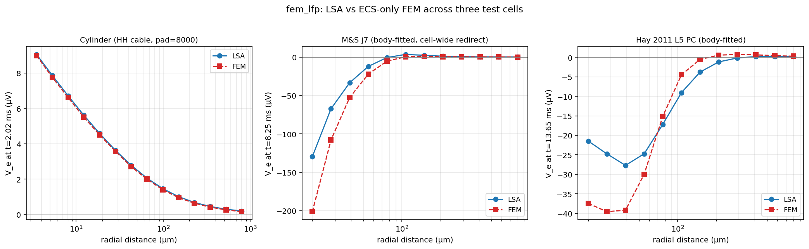

# fem_lfp

Hybrid LFP simulator. NEURON solves the 1D cable equation for intracellular
dynamics (V_m, gating, per-segment transmembrane current). A 3D FEM Poisson
solve in the **extracellular space only** then computes V_e from those
membrane currents — used as Neumann boundary data on the cell surface.



The aim is to compare against the line-source approximation (LSA) in the
near and far field, where LSA's infinite-homogeneous-medium assumption
breaks down (probe geometry, anisotropic σ, finite tissue boundaries).

This is a middle ground between full self-consistent EMI / KNP-EMI (solved
inside *and* outside the membrane, e.g. by the companion `fem_neuron`
project) and the standard LSA postprocessor (analytical line integral in an
infinite homogeneous medium). Cheaper than EMI; more geometrically faithful
than LSA.

## Math

ECS only. The transmembrane current i_mem(x,t) (computed by NEURON's
cable equation) enters as a Neumann boundary on the cell surface Γ_m.

```
∇·(σ ∇φ_e) = 0        in Ω_e
σ ∂φ_e/∂n_e = i_mem    on Γ_m    (n_e outward from ECS = into the cell;
                                   i_mem outward-positive ⇒ current
                                   flowing INTO the ECS at the membrane)
φ_e = 0                on Γ_outer (bounding box, Dirichlet far field)
```

Weak form, per timestep:

```
∫ σ ∇φ · ∇v dx = Σ_k (I_k(t) / A_k) ∫_{Γ_m,k} v ds
```

where Γ_m,k is the patch of cell surface owned by NEURON segment k, A_k
its area, and I_k(t) the per-segment transmembrane current in nA. The
bilinear form is time-independent — LU-factor once, refactor only when
geometry changes; per-step cost is RHS reassembly + back-substitution.

## Install

fem_lfp needs FEniCSx (dolfinx), gmsh, and NEURON. These don't co-install
cleanly from PyPI, so the simplest route is conda-forge:

```bash
conda create -n fem_lfp -c conda-forge fenics-dolfinx gmsh python=3.12
conda activate fem_lfp
pip install neuron        # or a platform-appropriate NEURON build
pip install -e .
```

That's everything the `cylinder` mesher needs. The `branched` and
`body_fitted` meshers additionally require [`fem_neuron`][fn] — a rough
companion research project — placed next to this repo or pointed to by
`FEM_LFP_FEM_NEURON_SRC`. `body_fitted` also needs a patched Alpha_Mesh_Swc
(see the body-fitted section below and `third_party/ams_patches/`).

[fn]: https://github.com/VBaratham/fem_neuron

## Quickstart

You drive your own NEURON simulation; `fem_lfp` turns it into an
extracellular potential. Build the model **before** `finitialize` (that
arms the current recording), run, then `solve`:

```python
import numpy as np
from neuron import h
from fem_lfp import ExtracellularModel

# ... build your cell, set nseg / biophysics / stimulus, then: ...
h.define_shape()                      # ensure every section has 3D points

probes_um = np.array([[r, 0.0, 0.0] for r in (20, 50, 100, 400)])
model = ExtracellularModel(h.allsec(), probes_um)   # arms recording

h.finitialize(-65); h.continuerun(30)

result = model.solve()                # V_e at every probe, shape (time, probe)
result.plot("lfp.png")                # V_m + V_e(t) + V_e(r) overlay
result.save("lfp.npz")                # everything, reloadable via .load()
```

`result.v_e_fem_uV` is the FEM solution in µV; `result.v_e_lsa_uV` is the
line-source approximation over the same currents, for reference.

**Knobs** (all optional, sensible defaults):

```python
ExtracellularModel(
    sections, probes_um,
    mesh="auto",        # "cylinder" | "branched" | "body_fitted" | "auto"
    sigma=0.3,          # extracellular conductivity, S/m
    ecs_pad_um=...,     # how far the tissue box extends past the cell
    h_membrane_um=...,  # mesh resolution at the membrane
    h_outer_um=...,     # mesh resolution at the box wall
)
```

`mesh="auto"` picks `cylinder` for a single straight z-cable and
`branched` for anything with real morphology. See `fem_lfp.MESHERS` for
what each mesher does. Only need the analytical reference?
`model.line_source()` skips the mesh and FEM entirely.

Progress and diagnostics go through the standard `logging` module (logger
`fem_lfp`); call `logging.basicConfig(level=logging.INFO)` to see them. The
library is silent by default.

## Bundled scenarios

Three worked examples, each a `scenario.py` (builds the cell) + a driver
script (wraps it in an `ExtracellularModel`). The reconstruction scenarios
download their cell from ModelDB and compile its NMODL mechanisms on first
run (cached afterward) — no manual cell setup.

```bash
# 1. Single-cylinder HH cable: clean FEM-vs-LSA demo (fully self-contained)
python scripts/cylinder_compare.py
python scripts/cylinder_pad_sweep.py    # box-size convergence study

# 2. Mainen & Sejnowski j7 spiny stellate (auto-downloads ModelDB 2488).
python scripts/ms_j7_compare.py                 # branched mesh (default)
python scripts/ms_j7_compare.py --body-fitted   # AMS+TetGen (see below)

# 3. Hay 2011 BBP-style L5 PC (auto-downloads ModelDB 139653).
python scripts/bbp_compare.py                   # body-fitted — needs AMS setup
python scripts/bbp_compare.py --branched        # no AMS, but very slow
```

Cell downloads land in `scenarios/<name>/cells/` (git-ignored).

Scenario 1 (cylinder) is fully standalone. Scenarios 2 and 3 auto-download
their cell data, but their meshers need [`fem_neuron`][fn] installed
(scenario 3's default body-fitted mesher additionally needs the one-time
Alpha_Mesh_Swc setup below).

### Meshers

- **`cylinder`** — self-contained, for a single straight cable. No extra deps.
- **`branched`** — fem_neuron fuses one cylinder per section (OpenCASCADE).
  Good for modest morphologies; its optimizer becomes impractically slow on
  large cells (Hay's 196 sections take 15+ min), which is why bbp defaults to
  body-fitted.
- **`body_fitted`** — AlphaMeshSwc wraps the whole cell in one watertight
  surface, then TetGen volume-meshes it. Cleanest for complex morphologies,
  but needs an external tool (below). `mesh="auto"` never selects it, so the
  default public-API path needs no external mesh tool.

### Running the body-fitted mesher (bbp, or `--body-fitted`)

The body-fitted path shells out to [Alpha_Mesh_Swc][ams] (AMS), a GPL-3.0
tool we don't vendor. It needs two small patches for real reconstructions
(one skips a self-intersection probe that hangs 25+ min on dense cells; one
fixes AMS ignoring `--min_faces`). One-time setup:

```bash
git clone https://github.com/AlexMcSD/Alpha_Mesh_Swc ~/Alpha_Mesh_Swc
bash third_party/ams_patches/apply.sh ~/Alpha_Mesh_Swc
export FEM_NEURON_AMS_ROOT=~/Alpha_Mesh_Swc      # or place at ~/claude/Alpha_Mesh_Swc
```

Then `python scripts/bbp_compare.py` just works. See
[`third_party/ams_patches/README.md`](third_party/ams_patches/README.md)
for exactly what the patches change and why. If you'd rather avoid AMS
entirely, `--branched` produces the same result on a small cell but is
impractically slow on Hay's L5 PC.

[ams]: https://github.com/AlexMcSD/Alpha_Mesh_Swc

## Validation

**Cylinder (200 µm × 5 µm HH cable):** clean LSA-vs-FEM agreement.
At near probes (r ≤ 100 µm) FEM matches LSA to ≤ 1-2 %; at far probes
the FEM/LSA ratio is dominated by Dirichlet wall pull-down, which
converges out as ``ecs_pad_um`` grows (1500 → 4000 → 8000 µm sweep
shows the ratio at r=800 µm rising 0.36 → 0.79 → 0.82). See
``scenarios/cylinder/pad_sweep.png``.

**M&S j7 (93 sections, 199 segments, 3-AP train):** body-fitted mesh
(AMS+TetGen) + cell-wide redirect of empty-bin currents gives a
clean qualitative match — sign at all probes, mid-field inversion
gone, far-field at r=800 within 60% of LSA. Near-field FEM/LSA at
r=20 = 1.55× — a residual offset from 4 NEURON segments (3 in axon
hillock, 1 small dendrite) that get redistributed cell-wide because
AMS's alpha-wrap merged the proximal hillock surface into the soma.
The redirected currents land at the soma's segment closest to the
original NEURON position (~5 µm displacement); residual amp
amplification is the signature of that displacement.

**Hay 2011 BBP-style L5 PC (196 sections, 642 segments, 2-AP burst):**
Best LSA-vs-FEM match in the suite — **0 empty bins** (Hay's
trimmed axon doesn't have the M&S thin-hillock geometry).
FEM/LSA tracks cleanly at all 12 probes: 1.75× at r=20 µm,
0.88× at r=77 µm, 1.20× at r=800 µm. Same waveform shape, same
sign across the entire 30 ms time window. The systematic 1.5–2×
offset at near probes is the actual LSA-vs-FEM physics gap —
FEM applies currents on the cell surface, LSA on a 1D line at the
center, and probes near the cell see the geometric difference.

## Layout

```
src/fem_lfp/
  model.py           # PUBLIC INTERFACE: ExtracellularModel + result object.
                     # Owns the whole pipeline; the rest is machinery it drives
  plotting.py        # shared FEM-vs-LSA overlay figure
  lsa.py             # closed-form line-source approximation (numpy-only)
  neuron_sim.py      # NEURON helpers: i_membrane capture, geometry capture,
                     # pt3d slicing, SWC export
  mesh_cylinder.py   # ECS-only mesh for a single cylindrical cell
  mesh_branched.py   # ECS-only mesh for branched cells via fem_neuron's
                     # OCC-fuse branched mesher + ECS submesh extraction
  mesh_body_fitted.py# ECS-only mesh via fem_neuron's body_fitted (AMS PLY
                     # + TetGen) — single watertight surface, no OCC fuse
                     # quality issues; mesh-cached under ~/.cache/fem_lfp_meshes/
  fem.py             # ECS Poisson solver: bilinear-form-once, RHS-per-step,
                     # CableSegmentation + BranchedSegmentation; cell-wide
                     # redirect of empty-bin currents to nearest non-empty
                     # 3D segment center
  modeldb.py         # download + compile ModelDB cells on demand (stdlib)
scenarios/           # example cells: <name>/scenario.py builds the cell
  cylinder/  ms_j7/  bbp/
scripts/             # driver CLIs that wrap a scenario in ExtracellularModel
  cylinder_compare.py  cylinder_pad_sweep.py
  ms_j7_compare.py     bbp_compare.py
  three_cell_summary.py
  diagnostics/       # dev/validation scripts, not part of the examples
tests/               # numpy-only unit tests (no dolfinx/neuron needed)
assets/              # figures used in the docs
third_party/
  ams_patches/       # two diffs for Alpha_Mesh_Swc (see its README):
                     # (1) skip a TetGen self-intersection probe that hangs
                     # (2) honor --min_faces (upstream ignored it)
```

Run the tests with `pip install -e '.[test]' && pytest` — they cover the
pure-Python parts (LSA, model helpers, ModelDB fetch) and need neither
dolfinx nor NEURON.

## License

MIT — see [LICENSE](LICENSE). The optional `body_fitted` mesher shells out
to Alpha_Mesh_Swc (GPL-3.0) as an external tool; it isn't vendored, so it
doesn't affect fem_lfp's license. The example cells are fetched from
ModelDB under ModelDB's terms, not redistributed here.
